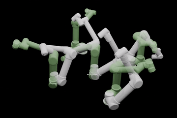
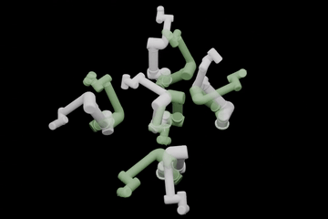

# NeHMO: Neural Hamilton-Jacobi Reachability Learning for Decentralized Safe Multi-Agent Motion Planning
[Paper](https://arxiv.org/abs/2507.13940) | [Video Demo](https://youtu.be/IZiePX0p1Mc)


<table>
    <td align="center">
      
    </td>
    <td align="center">
      
    </td>
  </tr>
</table>

## Introduction
We present Neural HJR-guided Multi-agent Motion Optimizer (NeHMO), a method that provides scalable neural Hamilton-Jacobi Reachability (HJR) modeling to tackle high-dimensional configuration spaces and enables decentralized multi-agent motion planning (MAMP). The learned HJR value functions are incorporated into a decentralized trajectory optimization framework, which solves MAMP tasks in real-time. We demonstrate that our method is both scalable and data-efficient, enabling the solution of MAMP problems in higher-dimensional scenarios with complex collision constraints. The proposed approach generalizes across various dynamical systems, including a 12-dimensional dual-arm setup, and outperforms a range of state-of-the-art techniques in successfully addressing challenging MAMP tasks. 

## Dependency
- Python 3.11 is used in this project.
- Run `pip install -r requirements.txt` to collect all python dependencies.
- [zonopy](https://github.com/roahmlab/zonopy) and [zonopy-robot](https://github.com/roahmlab/zonopy-robots) are required by the simulation environment. Please refer to their respective repositories following the hyperlinks for insllation instructions.

###


## Reproducing Results
### Planning Experiemnts
 - To download the trained HJR models from Google Drive:
```
pip install gdown
gdown --folder https://drive.google.com/drive/folders/1JuIAfa-2UHhuDMRdOxaDspDKPXtUevaG?usp=sharing
```

 - To run manipulator planning experiments:
```
bash planning_scripts/run_UR5_planning.sh         # Dual UR5
bash planning_scripts/run_triple_UR5_planning.sh  # Three UR5
bash planning_scripts/run_five_UR5_planning.sh    # Five UR5
```
For visulizations, one may specify the `--video` flag in the bash scripts. The experiments will generate planning results as a JSON file under `planning_results/`.

 - To run particle planning experiments:
 ```
 bash run_Particle_planning.sh  
 ```
This will run the experiments with 2, 8, 16, 32 agents and may therefore take long. Users can adjust the parameters in the bash scripts for their use cases; for visulizations, one may specify the `--video` flag in the bash scripts. The experiments will generate planning results as a JSON file under `planning_results/`. To also save planned trajectories, the user may substitute `--save_stats` with `--save_traj`.


### Learning experiments
 - To download the validation sets from Google Drive: 
 ```
 gdown --folder https://drive.google.com/drive/folders/1I5blpIog4UybxKygOESfnkWUNMNZmXvu?usp=sharing -O deepreach/
 ```

  - To run the learning experiments:
  ```
  bash deepreach/launch_particle_training.sh
  bash deepreach/launch_air3D_training.sh
  bash deepreach/simplearm_training.sh
  bash deepreach/launch_nn_arm_training.sh
  ```

  Note that to run the manipulator training example, the user needs to acquire the learned distance boundary condition model by
  ```
  gdown --folder https://drive.google.com/drive/folders/1w8HmZ9S_PWs1gPAbXUaYyyw7F2RM_om6?usp=sharing -O UR5_datasets_and_training/
  ``` 
The `UR5_datasets_and_training/` directory also contains the code to train the boundary condition models for reference.


## Credits and Acknowledgments
 - A majority of the code for HJR learning is adopted from [DeepReach](https://github.com/smlbansal/deepreach). We thank the authors and maintainers for their amazing work.
 -  The simulation environment is adopted from [Sparrows](https://roahmlab.github.io/sparrows/). We thank the authors and maintainers for their amazing work.

 ## Citation
If you find NeHMO useful, please consider citing using the following BibTex entry:
```
@misc{chen2025nehmoneuralhamiltonjacobireachability,
      title={NeHMO: Neural Hamilton-Jacobi Reachability Learning for Decentralized Safe Multi-Agent Motion Planning}, 
      author={Qingyi Chen and Ahmed H. Qureshi},
      year={2025},
      eprint={2507.13940},
      archivePrefix={arXiv},
      primaryClass={cs.RO},
      url={https://arxiv.org/abs/2507.13940}, 
}
```
